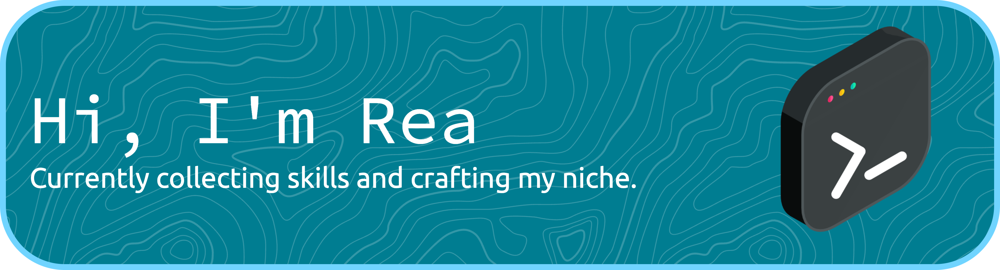
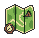

### &nbsp; About me

Curious builder. I make things across the stack; I've shipped backend APIs and cloud infrastructure, a published browser game, a native macOS app, and small automations that started as *"I wonder if I could…"*. I care
about making things that feel good to use, and I'm not afraid to learn a new corner of the stack
to get there.

- 📝 I occasionally post on [Substack](https://substack.com/@reamammen)
- 📸 I keep a photography / creative dump on [Instagram](https://www.instagram.com/rea_mammen/)
- 💬 Ask me about: **what I'm working on** 👀
- ⚡ Fun fact: **I think I'm funny**

---

### &nbsp; Languages and Tools

  
  
  
  
  
  
  
  
  
  
  
  
  
  
  
  

---

  
   

### &nbsp; Reach me

  
  
  
  

